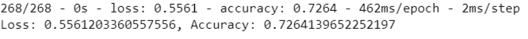
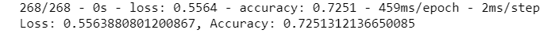
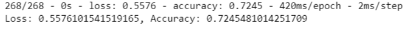

# Neural_Network_Charity_Analysis
## Overview
The purpose of this analysis was to use knowledge of machine learning and neural networks and use the features in the provided dataset to help Beks create a binary classifier that is capable of predicting whether applicants will be successful if funded by Alphabet Soup. This involved processing data for a neural network model, compiling, training, and evaluating the model, and optimizing the model

---
## Results
### Data Preprocessing
- The 'IS_SUCESSFUL' column is the target for the model
- All other columns, excluding 'IS_SUCCESSFUL' are the features for the model
- Variables that weren't a target or a feature are: 'EIN' and 'NAME'. They were removed

### Compiling, Training, and Evaluating the Model
- There are two hidden layers, with 80 neurons in the first layer and 30 in the second. The first and second layers has the 'relu' activation function, while the output layer has 'sigmoid'.
- The model did not reach the target accuracy of 75%, but the closest it came was 72.6%.
- In order to increase performance I tried a variety of things including removing additional features, increasing the amount of hidden layers, changing the activation function for a layer, and changing the amount of epochs.

First Attempt

Second Attempt

Third Attempt

---
## Summary
My last optimization attempt had a pretty similar accuracy as the others (approxiamtely 73%). I believe that the accuracy was impacted by overfitting. Adding more data may help to improve accuracy. We could have also chosen something other than a neural network. 
